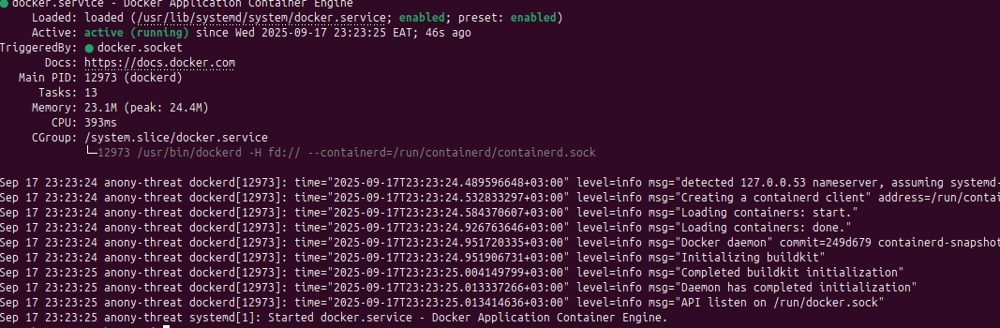

# DOCKER-BASED ETL PIPELINE

## Introduction

This project aims to develop a data pipeline that;

- Uses a python script to **E**xtract, **T**ransform and **L**oad data from a binance API.
- Utilizes Postgres to store the extracted data in tables.
- Uses Debezium to implement CDC (Change Data Capture) on the postgres database to track changes made on the datadase in realtime.
- Debezium will further publish the changes made on the database as events on Kafka topics in realtime.
- Cassandra will then consume the published topics from Kafka.
- All the above tools/services will then run in a docker container.
  
!!! note "Quick note"
    The steps followed in this documentation were done within the Linux Ubuntu (24.04.3 LTS) distro

## PostgreSQL installation & Configuration on Localhost

### Installing Postgresql
- Postgresql installation command: ```sudo apt install postgresql
postgresql-contrib```

- Enable and start postgresql using: ```sudo systemctl enable
postgresql && sudo systemctl start postgresql```

- Verify installation by checking the postgresql version: ```psql –
version```

### Additional settings (After installation)
- Set a password for the default user (postgres): ```sudo -u postgres
psql -c “ALTER USER postgres WITH PASSWORD ‘your-password’;”```

- Create a database with the user postgres: ```sudo -u postgres psql -
c “CREATE DATABASE {name-of-database};”```

- Grant user postgres all privileges to the created database: ```sudo
-u postgres psql -c “GRANT ALL PRIVILEGES ON DATABASE {name-of-
database} TO postgres;”```

#### Installation of psycopg2
**psycopg2** is the python adapter for Postgresql.

- Install psycopg2 dependencies (preferably within a virtual
environment): ```sudo apt install python3-dev libpg-dev```
- Psycopg2 installation: ```sudo apt install psycopg2-binary```

## Docker Installation
Docker is an open-source platform that allows developers to build, deploy, run, update and manage containerized applications on different machine environments.

Installation of Docker Community Edition is performed from Docker's official repository.

#### Step 1
Update the system's package index (good practice) using: ```sudo apt-get update```

#### Step 2
Installation of dependencies required to use Docker's repository over HTTPS: ```sudo apt-get install -y apt-transport-https ca-certificates curl software-properties-common```

#### Step 3
Import Docker's GPG key to verifify authenticity of the packages: ```curl -fsSL https://download.docker.com/linux/ubuntu/gpg | sudo gpg --dearmor -o /usr/share/keyrings/docker-archive-keyring.gpg```

#### Step 4
Add Docker's repository to the system's sources list: ```echo "deb [arch=$(dpkg --print-architecture) signed-by=/usr/share/keyrings/docker-archive-keyring.gpg] https://download.docker.com/linux/ubuntu $(lsb_release -cs) stable" | sudo tee /etc/apt/sources.list.d/docker.list > /dev/null```

#### Step 5
Install docker engine and related packages - CLI and containerd: ```sudo apt-get install -y docker-ce docker-ce-cli containerd.io```

#### Step 6
Verify docker installation: ```sudo systemctl status docker```

***Expected output***


#### Step 7
Additionally, docker can be tested using a test container: ```sudo docker run hello-world```

#### Step 8
By default, docker only allows running by super user (sudo), to allow execution by non-root users, add the user to the docker group: ```sudo usermod -aG docker {username}```

## Python ETL
Python is used to write an ETL script that;

- *Extracts* data from the binance api - ```https://api.binance.com/api/v3```- with the following endpoints; ```/api/v3/ticker/price``` (latest prices), ```/api/v3/depth``` (order book), ```/api/v3/trades``` (recent trades), ```/api/v3/klines``` (klines) and ```/api/v3/ticker/24hr```(24hr ticker stats)
- *Transforms* the data by selecting relevant columns, changing column data types, renaming columns, dropping columns etc
- *Loads* the transformed data into relevant tables in the postgreSQL database

Ensure the dependecies imported within the script are available by installing them from the ```requirements.txt``` file using ```pip install -r requirements.txt```

```requirements.txt```file
```txt
    requests
    sqlalchemy
    logging
    pandas
```
The python etl script is shown below;
```py
    import requests
    import pandas as pd
    from sqlalchemy import create_engine, text
    from datetime import datetime
    import time
    import logging

    # Configure logging
    logging.basicConfig(level=logging.INFO, format='%(asctime)s - %(levelname)s - %(message)s')
    logger = logging.getLogger(__name__)

    # Binance API configuration
    BASE_URL = "https://api.binance.com/api/v3"
    ENDPOINTS = {
        "latest_prices": "/ticker/price",
        "order_book": "/depth",
        "recent_trades": "/trades",
        "klines": "/klines",
        "ticker_24hr": "/ticker/24hr"
    }

    # PostgreSQL configuration
    DB_CONFIG = {
        'dbname': 'binance_crypto_db',
        'user': 'postgres',
        'password': '1234',
        'host': 'postgres',
        'port': '5432'
    }

    def create_tables(engine):
        """Create necessary tables in PostgreSQL if they don't exist"""
        create_tables_sql = [
            """
            CREATE TABLE IF NOT EXISTS latest_prices (
                id SERIAL PRIMARY KEY,
                symbol VARCHAR(50),
                price DECIMAL(20,8),
                timestamp TIMESTAMP DEFAULT CURRENT_TIMESTAMP
            )
            """,
            """
            CREATE TABLE IF NOT EXISTS order_book (
                id SERIAL PRIMARY KEY,
                symbol VARCHAR(50),
                bid_price DECIMAL(20,8),
                bid_quantity DECIMAL(20,8),
                ask_price DECIMAL(20,8),
                ask_quantity DECIMAL(20,8),
                timestamp TIMESTAMP DEFAULT CURRENT_TIMESTAMP
            )
            """,
            """
            CREATE TABLE IF NOT EXISTS recent_trades (
                id SERIAL PRIMARY KEY,
                symbol VARCHAR(50),
                price DECIMAL(20,8),
                quantity DECIMAL(20,8),
                trade_time BIGINT,
                is_buyer_maker BOOLEAN,
                timestamp TIMESTAMP DEFAULT CURRENT_TIMESTAMP
            )
            """,
            """
            CREATE TABLE IF NOT EXISTS klines (
                id SERIAL PRIMARY KEY,
                symbol VARCHAR(50),
                open_time BIGINT,
                open_price DECIMAL(20,8),
                high_price DECIMAL(20,8),
                low_price DECIMAL(20,8),
                close_price DECIMAL(20,8),
                volume DECIMAL(20,8),
                close_time BIGINT,
                timestamp TIMESTAMP DEFAULT CURRENT_TIMESTAMP
            )
            """,
            """
            CREATE TABLE IF NOT EXISTS ticker_24hr (
                id SERIAL PRIMARY KEY,
                symbol VARCHAR(50),
                price_change DECIMAL(20,8),
                price_change_percent DECIMAL(10,4),
                weighted_avg_price DECIMAL(20,8),
                prev_close_price DECIMAL(20,8),
                last_price DECIMAL(20,8),
                volume DECIMAL(20,8),
                timestamp TIMESTAMP DEFAULT CURRENT_TIMESTAMP
            )
            """
        ]
        
        try:
            with engine.connect() as conn:
                for sql in create_tables_sql:
                    conn.execute(text(sql))
                conn.commit()
            logger.info("Tables created successfully")
        except Exception as e:
            logger.error(f"Error creating tables: {e}")

    def fetch_binance_data(endpoint, symbol="BTCUSDT", **params):
        """Fetch data from Binance API"""
        url = f"{BASE_URL}{ENDPOINTS[endpoint]}"
        params['symbol'] = symbol
        try:
            response = requests.get(url, params=params)
            response.raise_for_status()
            return response.json()
        except requests.RequestException as e:
            logger.error(f"Error fetching {endpoint} data: {e}")
            return None

    def transform_latest_prices(data):
        """Transform latest prices data into DataFrame"""
        if isinstance(data, list):
            df = pd.DataFrame(data)[['symbol', 'price']]
        else:
            df = pd.DataFrame([data])[['symbol', 'price']]
            
        df['price'] = df['price'].astype(float)
        return df

    def transform_order_book(data, symbol):
        """Transform order book data into DataFrame"""
        bids = data.get('bids', [])[:5]
        asks = data.get('asks', [])[:5]
        df = pd.DataFrame({
            'symbol': symbol,
            'bid_price': [float(bid[0]) for bid in bids],
            'bid_quantity': [float(bid[1]) for bid in bids],
            'ask_price': [float(ask[0]) for ask in asks],
            'ask_quantity': [float(ask[1]) for ask in asks]
        })
        return df

    def transform_recent_trades(data, symbol):
        """Transform recent trades data into DataFrame"""
        df = pd.DataFrame(data[:50])[['price', 'qty', 'time', 'isBuyerMaker']]
        df['symbol'] = symbol
        df = df.rename(columns={'qty': 'quantity', 'time': 'trade_time', 'isBuyerMaker': 'is_buyer_maker'})
        df['price'] = df['price'].astype(float)
        df['quantity'] = df['quantity'].astype(float)
        return df

    def transform_klines(data, symbol):
        """Transform klines data into DataFrame"""
        df = pd.DataFrame(data, columns=[
            'open_time', 'open_price', 'high_price', 'low_price', 'close_price',
            'volume', 'close_time', 'quote_asset_volume', 'number_of_trades',
            'taker_buy_base_asset_volume', 'taker_buy_quote_asset_volume', 'ignore'
        ])
        df['symbol'] = symbol
        df = df[['symbol', 'open_time', 'open_price', 'high_price', 'low_price', 
                'close_price', 'volume', 'close_time']]
        df[['open_price', 'high_price', 'low_price', 'close_price', 'volume']] = \
            df[['open_price', 'high_price', 'low_price', 'close_price', 'volume']].astype(float)
        return df

    def transform_ticker_24hr(data):
        """Transform 24hr ticker data into DataFrame"""
        if isinstance(data, list):
            df = pd.DataFrame(data)
        else:
            df = pd.DataFrame([data])
        df = df[['symbol', 'priceChange', 'priceChangePercent', 'weightedAvgPrice', 
                'prevClosePrice', 'lastPrice', 'volume']]
        df = df.rename(columns={
            'priceChange': 'price_change',
            'priceChangePercent': 'price_change_percent',
            'weightedAvgPrice': 'weighted_avg_price',
            'prevClosePrice': 'prev_close_price',
            'lastPrice': 'last_price'
        })
        df[['price_change', 'price_change_percent', 'weighted_avg_price', 
            'prev_close_price', 'last_price', 'volume']] = \
            df[['price_change', 'price_change_percent', 'weighted_avg_price', 
                'prev_close_price', 'last_price', 'volume']].astype(float)
        return df

    def insert_data(engine, table, df):
        """Insert DataFrame into PostgreSQL"""
        try:
            df.to_sql(table, engine, if_exists='append', index=False)
            logger.info(f"Successfully inserted {len(df)} records into {table}")
        except Exception as e:
            logger.error(f"Error inserting into {table}: {e}")

    def main():
        # Create SQLAlchemy engine
        try:
            engine = create_engine(
                f"postgresql+psycopg2://{DB_CONFIG['user']}:{DB_CONFIG['password']}@"
                f"{DB_CONFIG['host']}:{DB_CONFIG['port']}/{DB_CONFIG['dbname']}"
            )
            logger.info("Connected to PostgreSQL database")
        except Exception as e:
            logger.error(f"Error connecting to database: {e}")
            return

        # Create tables
        create_tables(engine)

        symbol = "BTCUSDT"
        
        while True:
            try:
                # Fetch and process latest prices
                latest_prices = fetch_binance_data("latest_prices", symbol)
                if latest_prices:
                    df_prices = transform_latest_prices(latest_prices)
                    insert_data(engine, "latest_prices", df_prices)

                # Fetch and process order book
                order_book = fetch_binance_data("order_book", symbol, limit=5)
                if order_book:
                    df_book = transform_order_book(order_book, symbol)
                    insert_data(engine, "order_book", df_book)

                # Fetch and process recent trades
                recent_trades = fetch_binance_data("recent_trades", symbol, limit=50)
                if recent_trades:
                    df_trades = transform_recent_trades(recent_trades, symbol)
                    insert_data(engine, "recent_trades", df_trades)

                # Fetch and process klines (1 hour interval)
                klines = fetch_binance_data("klines", symbol, interval='1h', limit=100)
                if klines:
                    df_klines = transform_klines(klines, symbol)
                    insert_data(engine, "klines", df_klines)

                # Fetch and process 24hr ticker
                ticker_24hr = fetch_binance_data("ticker_24hr", symbol)
                if ticker_24hr:
                    df_ticker = transform_ticker_24hr(ticker_24hr)
                    insert_data(engine, "ticker_24hr", df_ticker)

                # Sleep to respect API rate limits
                time.sleep(60)  # Wait 1 minute before next fetch

            except Exception as e:
                logger.error(f"Error in main loop: {e}")
                time.sleep(300)  # Wait 5 minutes before retrying on error

    if __name__ == "__main__":
        main()
```
## Integration
Now that we have installed the key components of the project ie Python ETL, postgres DB (localhost) and docker; we now proceed to integrate them to work together.

### Project Directory Structure

The files used within the project will be structured as below. This will dictate the execution of all the project components once completed. 

```text
    project/
    ├── docker-compose.yml
    ├── etl.py # Your Python script
    ├── requirements.txt
    ├── init_db.sql # SQL to create DB, table, and replication user
    ├── postgresql.conf # Custom config for logical replication
    ├── connectors/
    │   └── datastax-kafka-connector/ # Unzipped connector files (jars)
    └── cassandra-init.cql # CQL to create keyspace and table
```

#### Docker Compose
Docker compose is a tool used to run multi-container applications on Docker. The compose file defines how one or more containers making up the application are configured.
Since our pipeline invloves running several services/containers in docker, docker compose will come in handy.

##### ***Docker compose installation***
- Run the command: ```sudo apt-get install -y docker-compose-plugin```
- Verify installation with: ```docker compose version```

The docker compose file will define the following services;

- ***zookeeper***: Runs Zookeeper which is required by Kafka for managing brokers.

- ***kafka***: Runs Kafka broker and depends on Zookeeper. It is configured for both internal and external listeners.

- ***Postgres***: Runs PostgreSQL, it initializes the database using ```init-db.sql``` and custom configuration from ```postgresql.conf```.

- ***kafka-connect***: Runs Debezium Kafka Connect and depends on Kafka and Postgres.It uses the Datastax Kafka connector from the connectors directory.

- ***cassandra***: Runs Cassandra (version 4.0) and exposes port 9042. Initializes schema using ```cassandra-init.cql```.

- ***python-etl***: Builds a custom Python ETL container from a Dockerfile in the current directory. It depends on Postgres and mounts the project directory and runs ```etl.py```.


```docker-compose.yml``` file

```yaml
    version: '3.8'
    services:
    zookeeper:
        image: confluentinc/cp-zookeeper:7.3.0
        container_name: zookeeper
        environment:
        ZOOKEEPER_CLIENT_PORT: 2181
        ZOOKEEPER_TICK_TIME: 2000
        ports:
        - "2181:2181"

    kafka:
        image: confluentinc/cp-kafka:7.3.0
        container_name: kafka
        depends_on:
        - zookeeper
        ports:
        - "9092:9092"
        environment:
        KAFKA_BROKER_ID: 1
        KAFKA_ZOOKEEPER_CONNECT: zookeeper:2181
        KAFKA_ADVERTISED_LISTENERS: PLAINTEXT://kafka:9092,PLAINTEXT_HOST://localhost:29092
        KAFKA_LISTENER_SECURITY_PROTOCOL_MAP: PLAINTEXT:PLAINTEXT,PLAINTEXT_HOST:PLAINTEXT
        KAFKA_INTER_BROKER_LISTENER_NAME: PLAINTEXT
        KAFKA_OFFSETS_TOPIC_REPLICATION_FACTOR: 1

    postgres:
        image: postgres:16
        container_name: postgres
        ports:
        - "5432:5432"
        environment:
        POSTGRES_USER: postgres
        POSTGRES_PASSWORD: 1234
        POSTGRES_DB: binance_crypto_db
        volumes:
        - ./init-db.sql:/docker-entrypoint-initdb.d/init.sql
        - ./postgresql.conf:/etc/postgresql/postgresql.conf
        command: -c config_file=/etc/postgresql/postgresql.conf

    kafka-connect:
        image: debezium/connect:2.5
        container_name: kafka-connect
        depends_on:
        - kafka
        - postgres
        ports:
        - "8083:8083"
        environment:
        BOOTSTRAP_SERVERS: kafka:9092
        GROUP_ID: 1
        CONFIG_STORAGE_TOPIC: connect_configs
        OFFSET_STORAGE_TOPIC: connect_offsets
        STATUS_STORAGE_TOPIC: connect_statuses
        CONNECT_KEY_CONVERTER: org.apache.kafka.connect.json.JsonConverter
        CONNECT_VALUE_CONVERTER: org.apache.kafka.connect.json.JsonConverter
        CONNECT_KEY_CONVERTER_SCHEMAS_ENABLE: "false"
        CONNECT_VALUE_CONVERTER_SCHEMAS_ENABLE: "false"
        CONNECT_PLUGIN_PATH: /kafka/connect
        volumes:
        - ./connectors/datastax-kafka-connector:/kafka/connect/datastax-kafka-connector

    cassandra:
        image: cassandra:4.0
        container_name: cassandra
        ports:
        - "9042:9042"
        volumes:
        - ./cassandra-init.cql:/init.cql
        command: bash -c "sleep 60 && cqlsh -f /init.cql"

    python-etl:
        build:
        context: .
        dockerfile: Dockerfile
        container_name: python-etl
        depends_on:
        - postgres
        volumes:
        - .:/app
        environment:
        - PYTHONUNBUFFERED=1  # Ensures logs are output in real-time
        command: python /app/etl.py

    networks:
    default:
        driver: bridge
```

#### Database Initialization
The ```init-db.sql``` is used to perform the following functions as relates to the database;

- Creates the database (*binance_crypto_db*).
- Establishes connection to the new database.
- Creates relevant tables for storing Binance data ie ***latest_prices, order_book, recent_trades, klines, and ticker_24hr***.
- Creates a user debezium with ***replication privileges*** and ***password***.
- Grants privileges to debezium for accessing the database and tables.
- Sets default privileges so debezium can select from future tables.
- Creates a logical replication slot named debezium_slot for CDC (Change Data Capture) using Debezium.

```init-db.sql``` file
```sql
    CREATE DATABASE binance_crypto_db;
    \c binance_crypto_db
    CREATE TABLE IF NOT EXISTS latest_prices (
        id SERIAL PRIMARY KEY,
        symbol VARCHAR(50),
        price DECIMAL(20,8),
        timestamp TIMESTAMP DEFAULT CURRENT_TIMESTAMP
    );
    CREATE TABLE IF NOT EXISTS order_book (
        id SERIAL PRIMARY KEY,
        symbol VARCHAR(50),
        bid_price DECIMAL(20,8),
        bid_quantity DECIMAL(20,8),
        ask_price DECIMAL(20,8),
        ask_quantity DECIMAL(20,8),
        timestamp TIMESTAMP DEFAULT CURRENT_TIMESTAMP
    );
    CREATE TABLE IF NOT EXISTS recent_trades (
        id SERIAL PRIMARY KEY,
        symbol VARCHAR(50),
        price DECIMAL(20,8),
        quantity DECIMAL(20,8),
        trade_time BIGINT,
        is_buyer_maker BOOLEAN,
        timestamp TIMESTAMP DEFAULT CURRENT_TIMESTAMP
    );
    CREATE TABLE IF NOT EXISTS klines (
        id SERIAL PRIMARY KEY,
        symbol VARCHAR(50),
        open_time BIGINT,
        open_price DECIMAL(20,8),
        high_price DECIMAL(20,8),
        low_price DECIMAL(20,8),
        close_price DECIMAL(20,8),
        volume DECIMAL(20,8),
        close_time BIGINT,
        timestamp TIMESTAMP DEFAULT CURRENT_TIMESTAMP
    );
    CREATE TABLE IF NOT EXISTS ticker_24hr (
        id SERIAL PRIMARY KEY,
        symbol VARCHAR(50),
        price_change DECIMAL(20,8),
        price_change_percent DECIMAL(10,4),
        weighted_avg_price DECIMAL(20,8),
        prev_close_price DECIMAL(20,8),
        last_price DECIMAL(20,8),
        volume DECIMAL(20,8),
        timestamp TIMESTAMP DEFAULT CURRENT_TIMESTAMP
    );
    CREATE USER debezium WITH REPLICATION LOGIN PASSWORD 'debezium_pass';
    GRANT ALL PRIVILEGES ON DATABASE binance_crypto_db TO debezium;
    GRANT SELECT ON ALL TABLES IN SCHEMA public TO debezium;
    ALTER DEFAULT PRIVILEGES IN SCHEMA public GRANT SELECT ON TABLES TO debezium;
    SELECT pg_create_logical_replication_slot('debezium_slot', 'pgoutput');
```
The ```postgresql.conf``` file is used to outline settings that enable logical replication in postgreSQL. These settings are important for enabling Change Data Capture (CDC) and allowing Debezium to capture and stream database changes.

```postgresql.conf``` file

```conf
    wal_level = logical #sets the Write-Ahead Logging level to logical
    max_replication_slots = 1 #limits number of replication slots to 1. Replication slots stream chages to consumers
    max_wal_senders = 1 #allows one WAL sender process responsible for sending WAL data to replication clients
```
#### Debezium Kafka Connect
This service allows for real-time data streaming from database to kafka topics using CDC.
Debezium Kafka Connect acts as the bridge between the database and kafka continuously streaming database changes as events to kafka topics thus enabling real-time data integration and synchronization across the data pipeline.
For this project, the Datastax Apache Kafka Connector was used. It was downloaded from *[debezium-kafka-connector-download-link](https://github.com/datastax/kafka-sink/releases)*, unzipped and placed in the ```connectors``` folder in the project root folder.
#### Cassandra Setup
Cassandra will be the consumer of the data published on kafka topics hence the need for a cassandra schema to store the streamed data.

The ```cassandra-init.cql``` performs the actions below;

- Creates a keyspace named ***binance*** with SimpleStrategy replication and a replication factor of 1 (suitable for single-node setups).
- Uses the ***keyspace binance*** for subsequent table creation.
- Creates the relevant tables (latest_prices, order_book, recent_trades, klines, ticker_24hr) to store Binance data, each with relevant columns for symbols, prices, quantities, timestamps and other trading information.
- Defines id as the primary key for each table to uniquely identify records.

```cassandra-init.cql``` file
```cql
    CREATE KEYSPACE binance WITH replication = {'class': 'SimpleStrategy', 'replication_factor': 1};
    USE binance;
    CREATE TABLE latest_prices (
        id INT PRIMARY KEY,
        symbol TEXT,
        price DECIMAL,
        timestamp TIMESTAMP
    );
    CREATE TABLE order_book (
        id INT PRIMARY KEY,
        symbol TEXT,
        bid_price DECIMAL,
        bid_quantity DECIMAL,
        ask_price DECIMAL,
        ask_quantity DECIMAL,
        timestamp TIMESTAMP
    );
    CREATE TABLE recent_trades (
        id INT PRIMARY KEY,
        symbol TEXT,
        price DECIMAL,
        quantity DECIMAL,
        trade_time BIGINT,
        is_buyer_maker BOOLEAN,
        timestamp TIMESTAMP
    );
    CREATE TABLE klines (
        id INT PRIMARY KEY,
        symbol TEXT,
        open_time BIGINT,
        open_price DECIMAL,
        high_price DECIMAL,
        low_price DECIMAL,
        close_price DECIMAL,
        volume DECIMAL,
        close_time BIGINT,
        timestamp TIMESTAMP
    );
    CREATE TABLE ticker_24hr (
        id INT PRIMARY KEY,
        symbol TEXT,
        price_change DECIMAL,
        price_change_percent DECIMAL,
        weighted_avg_price DECIMAL,
        prev_close_price DECIMAL,
        last_price DECIMAL,
        volume DECIMAL,
        timestamp TIMESTAMP
    );
```


Now that we have setup the various components of the pipeline, we can run the following commands to execute the project;

- ```docker-compose up --build```: this command starts and runs services defined within the ***docker-compose.yml*** file.


!!! note "Quick note"
    The command (```docker-compose up --build```) is run within the root folder of the project...